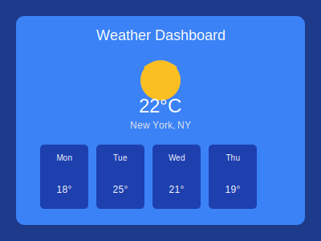
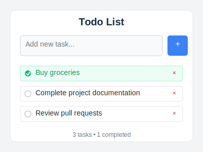
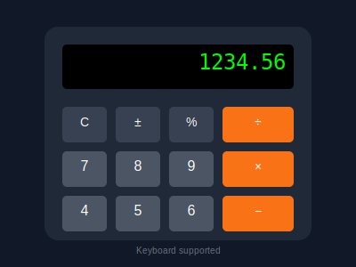

# 🚀 GenAI App Builder

An intelligent web application builder powered by Google Gemini API that generates complete HTML, CSS, and JavaScript projects from simple text prompts. This tool uses a multi-agent system with LangGraph to plan, architect, and code full-stack web applications automatically.

## 🌟 Features

- **🤖 AI-Powered Generation**: Uses Google Gemini 2.0 Flash for intelligent code generation
- **📁 Unique Project Management**: Each generation creates a uniquely numbered project folder
- **🏗️ Multi-Agent Architecture**: Planner → Architect → Coder workflow using LangGraph
- **🎨 Complete Web Apps**: Generates HTML, CSS, and JavaScript files for functional web applications
- **🔧 Interactive Error Editing**: Command-line editor for fixing code issues in real-time
- **🔍 Smart Error Detection**: Automatic validation of HTML, CSS, JavaScript, and JSON files
- **⚡ Fast & Reliable**: Optimized for quick project scaffolding and prototyping

## 📋 Table of Contents

- [Installation](#installation)
- [Quick Start](#quick-start)
- [Interactive Error Editing](#interactive-error-editing)
- [Generated Projects](#generated-projects)
- [Project Structure](#project-structure)
- [Configuration](#configuration)
- [Examples](#examples)
- [Contributing](#contributing)
- [License](#license)

## 🔧 Installation

### Prerequisites

- Python 3.10+
- Google Gemini API key
- Git (for version control)

### Setup Instructions

1. **Clone the repository**
   ```bash
   git clone https://github.com/omshivarjun/genai.git
   cd genai
   ```

2. **Create virtual environment**
   ```bash
   python -m venv .venv
   # Windows
   .venv\Scripts\activate
   # Linux/Mac
   source .venv/bin/activate
   ```

3. **Install dependencies**
   ```bash
   pip install -e .
   # or using uv (faster)
   uv sync
   ```

4. **Configure environment variables**
   ```bash
   cp .env.example .env
   # Edit .env and add your Google Gemini API key
   ```

## 🚀 Quick Start

1. **Run the application**
   ```bash
   python main.py
   ```

2. **Enter your project prompt**
   ```
   Create a simple calculator app with HTML, CSS and JavaScript
   ```

3. **Find your generated project**
   ```
   📁 generated_projects/
   └── 📁 generated_projects_1/
       ├── 📄 index.html
       ├── 📄 style.css
       └── 📄 script.js
   ```

## 🔧 Interactive Error Editing

The GenAI App Builder includes a powerful interactive editing system that automatically detects errors in generated code and provides a GitHub Copilot-like command-line editing experience.

### 🔍 Automatic Error Detection

After generating a project, the system automatically validates:
- **HTML**: Unclosed tags, malformed structure, missing elements
- **CSS**: Unclosed braces, syntax errors, malformed selectors  
- **JavaScript**: Syntax errors, unclosed functions, missing semicolons
- **JSON**: Invalid JSON structure in package.json files

### 🎯 Interactive Editor Commands

When errors are detected, you can use the interactive editor with these commands:

```bash
📝 Interactive Code Editor Commands:
  edit <line>          - Edit specific line
  insert <line>        - Insert line after specified line  
  delete <line>        - Delete specific line
  replace <start> <end> - Replace lines from start to end
  show                 - Show file with errors highlighted
  save                 - Save changes to file
  test                 - Re-run error detection  
  exit                 - Exit editor
  help                 - Show command help
```

### 🚀 Enhanced Usage Modes

1. **Automatic Mode** - Run with error detection:
   ```bash
   python main_with_editor.py
   ```

2. **Standalone Editor** - Edit existing projects:
   ```bash
   python test_interactive_editor.py
   ```

3. **Test Mode** - Try the editor with sample errors:
   ```bash
   python test_interactive_editor.py
   # Choose option 1 to create test files with errors
   ```

### ✨ Editor Features

- **Line-by-line editing** with syntax highlighting
- **Error highlighting** shows problematic lines with ❌
- **Real-time validation** after each edit
- **Multi-file support** for complex projects
- **Undo-safe editing** with confirmation prompts
- **Smart error detection** using Node.js validation when available

## �️ Architecture


The GenAI App Builder uses a sophisticated multi-agent architecture powered by LangGraph:

1. **Planner Agent** - Analyzes requirements and defines features
2. **Architect Agent** - Designs file structure and component relationships  
3. **Coder Agent** - Implements the actual HTML, CSS, and JavaScript code
4. **Unique Folder System** - Each generation creates numbered project folders

## �🎯 Generated Projects

### Weather Dashboard

- **Location**: `generated_projects/generated_projects_1/`
- **Features**: Geolocation API, Weather API integration, Responsive design
- **Technologies**: HTML5, CSS3, JavaScript ES6

### To-Do List Application

- **Location**: `generated_projects/generated_projects_2/`
- **Features**: Add/Delete tasks, Mark as complete, Local storage
- **Technologies**: HTML5, CSS3, JavaScript ES6

### Calculator Application

- **Location**: `generated_projects/generated_projects_3/`
- **Features**: Basic arithmetic, Keyboard support, Error handling
- **Technologies**: HTML5, CSS3, JavaScript ES6

## 📁 Project Structure

```
genai/
├── 📁 .github/                    # GitHub configuration
│   ├── 📄 copilot-instructions.md
│   └── 📁 instructions/
├── 📁 agent/                      # Core AI agents
│   ├── 📄 __init__.py
│   ├── 📄 graph.py               # LangGraph workflow
│   ├── 📄 prompts.py             # AI prompts
│   ├── 📄 states.py              # State management
│   └── 📄 tools.py               # File operations
├── 📁 generated_projects/         # Output directory
│   ├── 📁 generated_projects_1/   # Weather Dashboard
│   ├── 📁 generated_projects_2/   # Todo List
│   └── 📁 generated_projects_3/   # Calculator
├── 📁 images/                     # README images
├── 📄 .env.example               # Environment template
├── 📄 .gitignore                 # Git ignore rules
├── 📄 main.py                    # Entry point
├── 📄 pyproject.toml             # Dependencies
├── 📄 README.md                  # This file
└── 📄 uv.lock                    # Dependency lock file
```

## ⚙️ Configuration

### Environment Variables

Create a `.env` file based on `.env.example`:

```env
# Google Gemini API Key (Required)
GOOGLE_API_KEY=your_google_gemini_api_key_here

# Optional: Groq API Key (Legacy support)
# GROQ_API_KEY=your_groq_api_key_here
```

### Getting a Google Gemini API Key

1. Visit [Google AI Studio](https://makersuite.google.com/app/apikey)
2. Sign in with your Google account
3. Click "Create API Key"
4. Copy the key to your `.env` file

## 🎨 Examples

### Example 1: E-commerce Landing Page
```bash
python main.py
# Prompt: "Create an e-commerce landing page with product grid, shopping cart, and checkout form"
```

### Example 2: Portfolio Website
```bash
python main.py
# Prompt: "Build a personal portfolio website with about section, projects gallery, and contact form"
```

### Example 3: Blog Platform
```bash
python main.py
# Prompt: "Generate a blog platform with post listing, article view, and comment system"
```

## 🔍 How It Works

### Multi-Agent Architecture

1. **🧠 Planner Agent**
   - Analyzes user requirements
   - Creates project structure plan
   - Defines features and technical stack

2. **🏗️ Architect Agent**
   - Designs file architecture
   - Plans component relationships
   - Defines implementation steps

3. **👨‍💻 Coder Agent**
   - Implements HTML structure
   - Writes CSS styling
   - Develops JavaScript functionality

### Unique Folder System

Each project generation creates a new numbered folder:
```
generated_projects/
├── generated_projects_1/    # First project
├── generated_projects_2/    # Second project
├── generated_projects_3/    # Third project
└── ...                      # And so on
```

## 🔧 Advanced Usage

### Custom Project Types

The system can generate various types of web applications:

- **Static Websites**: Landing pages, portfolios, documentation
- **Interactive Apps**: Games, calculators, utilities  
- **Dashboard Apps**: Analytics, monitoring, admin panels
- **E-commerce**: Product catalogs, shopping carts
- **Content Management**: Blogs, news sites, wikis

### API Integration Examples

Generated projects can include API integrations:

```javascript
// Weather API example (auto-generated)
async function getWeatherData(latitude, longitude) {
    const apiKey = "YOUR_API_KEY";
    const apiUrl = `https://api.openweathermap.org/data/2.5/forecast?lat=${latitude}&lon=${longitude}&appid=${apiKey}`;
    
    try {
        const response = await fetch(apiUrl);
        const data = await response.json();
        return data;
    } catch (error) {
        console.error("Error fetching weather data:", error);
        return null;
    }
}
```

## 🛠️ Development

### Running in Development Mode

```bash
# Install development dependencies
pip install -e ".[dev]"

# Run with debug logging
python main.py --debug

# Watch for file changes (if available)
python main.py --watch
```

### Testing Generated Projects

Each generated project can be tested by:

1. Opening `index.html` in a web browser
2. Using a local development server:
   ```bash
   cd generated_projects/generated_projects_1
   python -m http.server 8000
   # Visit http://localhost:8000
   ```

## 🤝 Contributing

We welcome contributions! Here's how to get started:

1. **Fork the repository**
2. **Create a feature branch**
   ```bash
   git checkout -b feature/amazing-feature
   ```
3. **Make your changes**
4. **Add tests if applicable**
5. **Commit your changes**
   ```bash
   git commit -m "Add amazing feature"
   ```
6. **Push to the branch**
   ```bash
   git push origin feature/amazing-feature
   ```
7. **Open a Pull Request**

### Development Guidelines

- Follow PEP 8 style guidelines
- Add docstrings to functions and classes
- Include error handling
- Test generated projects manually
- Update README for new features

## 📊 Performance

### Generation Speed
- **Average time**: 30-60 seconds per project
- **File generation**: 3 files (HTML, CSS, JS)
- **API calls**: Optimized with Gemini 2.0 Flash

### Resource Usage
- **Memory**: ~100MB during generation
- **Storage**: ~10KB per generated project
- **Network**: Minimal (only API calls)

## 🐛 Troubleshooting

### Common Issues

1. **API Key Error**
   ```
   Error: Invalid API key
   Solution: Check your .env file and API key validity
   ```

2. **Import Error**
   ```
   Error: No module named 'langchain'
   Solution: Run pip install -e . or uv sync
   ```

3. **Generation Timeout**
   ```
   Error: Request timeout
   Solution: Check internet connection and API limits
   ```

### Debug Mode

Enable debug logging:
```python
import logging
logging.basicConfig(level=logging.DEBUG)
```

## 📄 License

This project is licensed under the MIT License - see the [LICENSE](LICENSE) file for details.

## 🙏 Acknowledgments

- **Google Gemini API** for powerful AI capabilities
- **LangChain** for agent framework
- **LangGraph** for workflow management
- **UV** for fast package management

## 📞 Support

- **Issues**: [GitHub Issues](https://github.com/omshivarjun/genai/issues)
- **Discussions**: [GitHub Discussions](https://github.com/omshivarjun/genai/discussions)
- **Email**: [Contact](mailto:support@genai.dev)

---

<div align="center">

**⭐ Star this repository if it helped you build amazing web applications! ⭐**

[Report Bug](https://github.com/omshivarjun/genai/issues) • [Request Feature](https://github.com/omshivarjun/genai/issues) • [Documentation](https://github.com/omshivarjun/genai/wiki)

</div>

---

*Built with ❤️ using Google Gemini AI and LangGraph*
